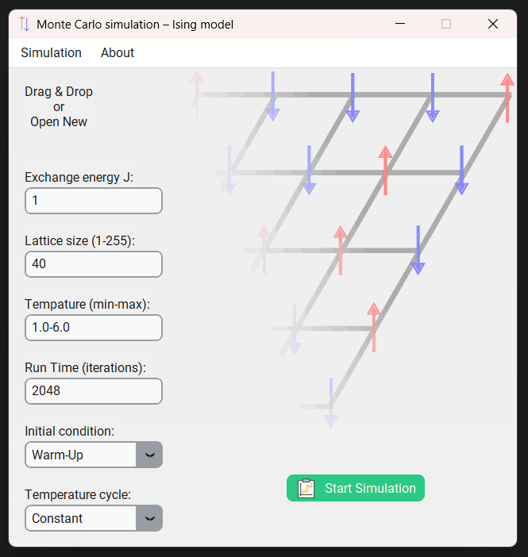

# Isingův model ve 3D


## Obsah
- [Isingův model ve 3D](#isingův-model-ve-3d)
  - [Obsah](#obsah)
  - [Úvod](#úvod)
  - [Instalace](#instalace)
  - [Ovládání programu](#ovládání-programu)

## Úvod
Apliakce vznikla na základě zadání semestrální práce na Vysoké škole chemicko-technologické v Praze. Bližší informace v <a href="https://github.com/vencelj/MC_Ising/blob/main/protocol/protokol_vencelj.pdf">protokolu</a>.

## Instalace
Aplikace byla vyvinuta pro Linux a Windows.
1. **Klonování úložiště**
    ```bash
    git clone [https://github.com/vencelj/MC_Ising.git](https://github.com/vencelj/MC_Ising.git)
    cd MC_Ising
2. **Potřebné moduly**
    ```bash
    pip install -r requirements.txt
3. **Spuštění programu**
    ```bash
    python main.py
## Ovládání programu

<br>
1. Nastavení<br>
V hlavním menu nastavte parametry simulace (redukované jednotky):
   1. $J$ – interakční energie 
   2. $L$ – Velikost mřížky
   3. $T_\mathrm{min}-T_\mathrm{max}$ – teplotní rozsah termálního cyklu
   4. teplotní režim  
   5. inicializační metodu 
   6. $t$ – počet iterací
1. Simulace<br>
Simulaci lze spustit CTRL+r.<br>
1. Výsledky<br>
Po doběhnutí simulace se automaticky načte okno s výsledky: grafy magnetizace $M$, energie $E$ a teplotní průběh. Zároveň se grafy automaticky uloží do složky pojmenované _simulation_rrrrmmddhhmmss_. Spolu s grafy se exportuje i video _*.mp4_ s animací mřížky.<br>
1. Načtění předchozích výsledků<br>
Pomocí Drag&Drop, CTRL+o, nebo Menu->Open New lze otevřít složku _simulation_rrrrmmddhhmmss_ obsahující již jednou vygenerované výsledky.<br>